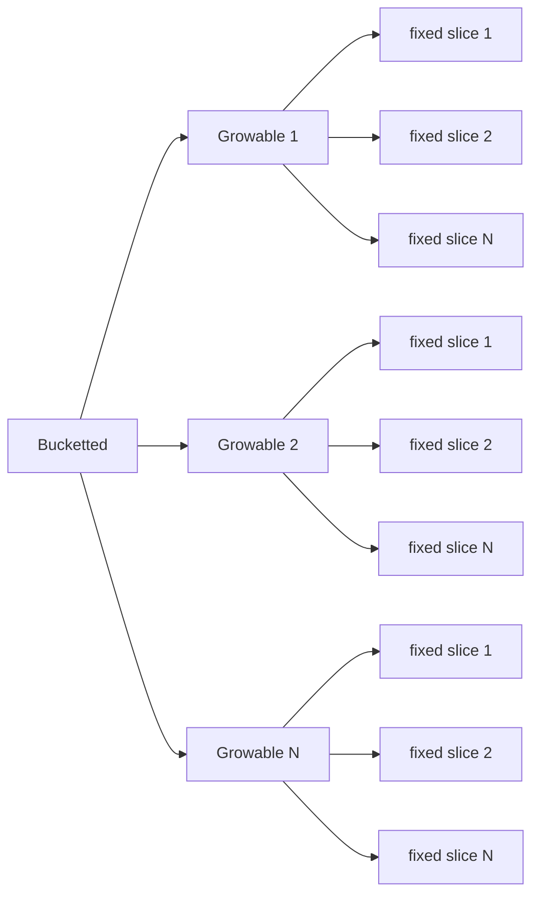

# Architecture

```mermaid
flowchart LR
    bucket[Bucketted] --> growable1[Growable 1]
    bucket[Bucketted] --> growable2[Growable 2]
    bucket[Bucketted] --> growableN[Growable N]

	growable1 --> slice11[fixed slice 1]
	growable1 --> slice12[fixed slice 2]
	growable1 --> slice1N[fixed slice N]

	growable2 --> slice21[fixed slice 1]
	growable2 --> slice22[fixed slice 2]
	growable2 --> slice2N[fixed slice N]

	growableN --> slice31[fixed slice 1]
	growableN --> slice32[fixed slice 2]
	growableN --> slice3N[fixed slice N]
```
